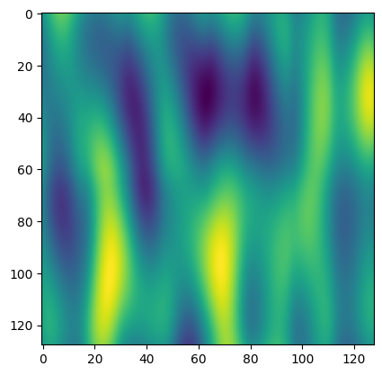
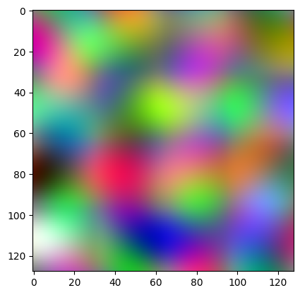
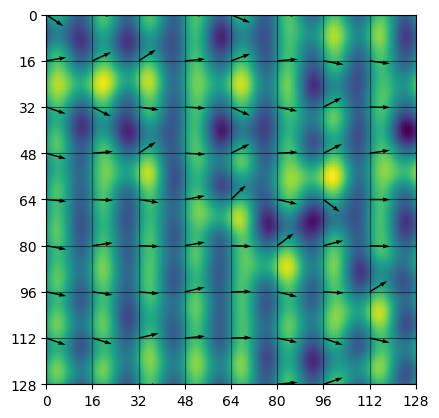

# Perlin Noise

[Perlin Noise](https://en.wikipedia.org/wiki/Perlin_noise) is a rather simple way to generate complex noise data, and easily implemented in pytorch. This implementation requires that resolution of the random data has to be divisble by the grid resolution, because this allows using `torch.nn.functional.unfold` on the random vectors of the grid.

## Installation

Simply install from github with:

```
python -m pip install git+https://github.com/tasptz/pytorch-perlin-noise
```

## Simple Usage


```python
from perlin_noise import perlin_noise
from matplotlib import pyplot as plt
```


```python
noise = perlin_noise(grid_shape=(2, 8), out_shape=(128, 128))

plt.imshow(noise);
```


    

    


## RGB Noise

It is also simple to generate rgb noise:


```python
noise = perlin_noise(grid_shape=(4, 4), out_shape=(128, 128), batch_size=3)

mi, ma = noise.min(), noise.max()
noise = (noise - mi) / (ma - mi)

plt.imshow(noise.permute(1, 2, 0));
```


    

    


## Special Usage

The function `perlin_noise_tensor` accepts the random vectors, grid cell positions and interpolation function directly which gives much more control. For example:


```python
import torch
from torch.distributions.von_mises import VonMises
from perlin_noise import perlin_noise_tensor, unfold_grid, get_positions
from plot_helper import grid_plot

angle = (
    VonMises(
        loc=torch.zeros(1),
        concentration=torch.tensor((10.0,)),
    )
    .sample((1, 9, 9))
    .squeeze(-1)
)
grid = torch.stack((torch.cos(angle), torch.sin(angle)), dim=1)

noise = perlin_noise_tensor(
    vectors=unfold_grid(grid),
    positions=get_positions((16, 16)),
    step=lambda t: ((6.0 * t - 15.0) * t + 10.0) * t * t * t,
)

grid_plot(grid, noise[0]);
```


    

    

